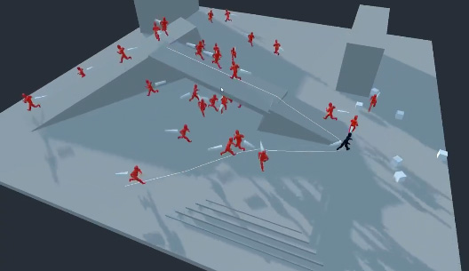

# Godot Kinematic Character A.I Study

AI Mechanics with Emphasis on Root Motion Kinematic Characters

Author: Chris Phyffer (https://phyffer.com)

A study on developing NPC, Enemy and Beast A.I in Godot Engine 3.1.1

This project includes:
- Navigation through the navmesh with Root Motion Rigged Kinematic Characters
- Customizeable Field of View with Debug Scanlines
- Raycast to Character (So that characters may hide behind other bodies.)

# License
Written By Christopher Phyffer (2019)
MIT - See [LICENSE](LICENSE) for details
